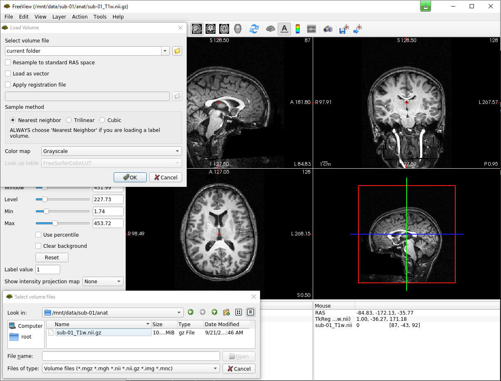
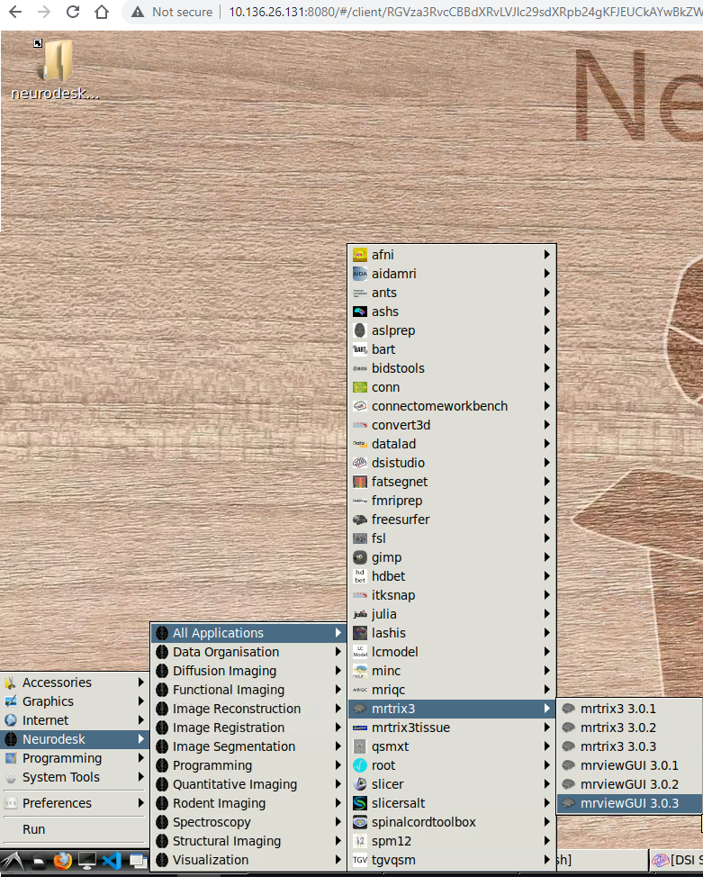

Docker Info
====

For group member who is new to Docker, there is nice tutorial_ and videos_ to learn Docker. 
Why are we using Docker? We had so many issues with the old server due to the dependencies. For instance, using ``fmriprep`` requires 8 other software, each of them needs some other packages. At the end of the day, the software may still not work because of compatibility or other unknown conflicts. While Docker runs software in an isolated container(environment) without bothering the OS configuration.

Most neuroimaging software offered their official Docker image which can be directly used for your analysis. Once you have been added to the Docker group (if you are not, please call 7849), you can use Docker commands.

.. _tutorial: https://docker-curriculum.com/
.. _videos: https://www.youtube.com/watch?v=fqMOX6JJhGo

*Display all loaded images in the system:*

::

   docker images

::

   REPOSITORY              TAG             IMAGE ID       CREATED         SIZE
   dsistudio/dsistudio     latest          a7cbee1c3895   11 days ago     1.78GB
   vnmd/neurodesktop       20210929        faea6488bafb   12 days ago     3.47GB
   freesurfer/freesurfer   freeviewAvail   09e4aa459595   2 weeks ago     15.4GB
   hello-world             latest          feb5d9fea6a5   2 weeks ago     13.3kB
   hello-world             linux           feb5d9fea6a5   2 weeks ago     13.3kB
   centos                  centos7         eeb6ee3f44bd   3 weeks ago     204MB
   centos                  centos8         5d0da3dc9764   3 weeks ago     231MB
   nipreps/fmriprep        latest          fcfc5f9bfd20   5 weeks ago     24.9GB
   freesurfer/freesurfer   7.2.0           8e15973a3dcd   5 weeks ago     12.5GB
   mrtrix3/mrtrix3         3.0.3           5902d5a6aa38   2 months ago    1.93GB
   poldracklab/mriqc       0.16.1          77dee0ba9d5a   8 months ago    8.38GB
   poetair/fsl6.0.3_x11    latest          9a71492f908e   10 months ago   14.4GB

There are several popular software installed already, for an example of using ``mriqc`` which is a tool to perform quality assessments for imaging data, please check the `notes <https://sarenseeley.github.io/BIDS-fmriprep-MRIQC.html#mriqc>`_

Freeview example with Docker
----

Here, I introduce a brief example of using a GUI app such as ``freeview`` with Docker.

Firstly, we lunch freesurfer from Docker by: 

::

   docker run --name kenTest -it -v /home/ken/fmriExample/fmriData/:/mnt/data 09e4aa459595 bash
   
where ``-it`` instructs Docker to allocate a pseudo-TTY connected to the container’s stdin; creating an interactive bash shell in the container. ``-v`` bind a volume which in this case is the dataset we wanted to use from the server path: ``/home/ken/fmriExample/fmriData/`` with freesurfer and mount it at path : ``/mnt/data`` in the container.  ``09e4aa459595`` is the Image ID. 

.. warning::

   Importantly, please specify the ``--name`` involves your user name, otherwise, Docker will assign a name randomly, these random names would be seen as a redundant process and cleaned during the regular maintenance. In addition, you may add ``--rm`` flag indicating removal of the container after exit.

Once the previous step executed, you will see the command header becomes: 

::

   [root@<container ID>]#
   
Because freesurfer requires a license, you need to download a free license in order to use the software via link_. Then, copy the license file to the relevant path in the freesurfer software: 

::

   cp /mnt/data/derivatives/license.txt /usr/local/freesurfer/.license
   
Further, we set up the display variable ``$DISPLAY`` with your own computer IP:

::

   export DISPLAY=<ip address>:0.0

``<ip address>`` have to fill your own computer IP address. The last step is just open freeview:

::

   freeview

.. _link: https://surfer.nmr.mgh.harvard.edu/fswiki/License
   
   
.. Note::

   Running FSL in Docker may report an error related to ``$USER`` at the start of processing, this is because the ``$USER`` variable in the docker is not specified, you can either try ``export USER=root`` or manually adding a user which matches your server user name in the container before processing data(E.g,. ``useradd -m <your user name>``).  In Docker, output files are usually owned by ``root`` user that is why you will involve adding a user in your script. Then you may use ``runuser -u <your user name> -- fsl`` to run the GUI. In this way, the output file will be saved under your user name.

Neurodesktop example with Docker
----

Since GUI related components are not usually included in official Docker images and install these library may not be ideal solution but we can utilize Neurodesktop!!! For the official tutorial, please check `here. <https://neurodesk.github.io/docs/neurodesktop/getting-started/linux/>`_ I just give a simple example here for your convenience.

Start container with Neurodesktop image, this process takes 5 mins to be finished. The ``-p`` option specifies the port number which should be different among users on the server.

::

   docker run   --shm-size=1gb -it --privileged --name neurodesktop -v ~/neurodesktop-storage:/neurodesktop-storage -e HOST_UID="$(id -u)" -e HOST_GID="$(id -g)" -p 8080:8080 -h neurodesktop-20210929 vnmd/neurodesktop:20210929

Once you have seen a log message as ``http://localhost:8080/#/?username=user&password=password`` then you can open your browser and type the following code. The port number may be different sine you may specify one other than 8080. 

:: 

   http://10.136.26.131:<port>/#/?username=user&password=password

The browser will display the desktop as below, it contains almost all the imaging processing apps and you can also use the GUI freely:

.. warning::

  When the first time opening an app, the desktop will automatically download the corresponding images and load for you. Before downloading, please do the follows
  
In your mount folder ``neurodesktop-storage``, there is a file named ``neuroDesktopBashrc`` (if you did not find, please call 7849) which should override the default one inside of the container. Firstly can open a terminal and navigate to the mounted folder, for example: 

:: 

   cd /neurodesktop-storage/

then execute the following to copy: 

:: 

   cp neuroDesktopBashrc ~/.bashrc
   
Once this is done successfully, the apps should work properly.

   
   
