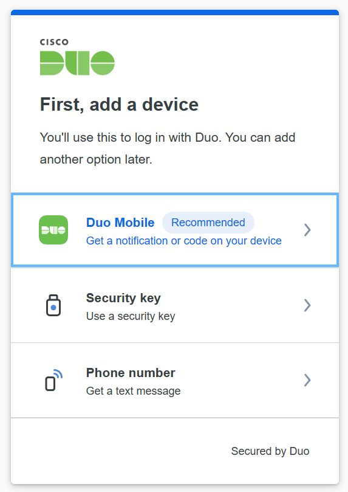
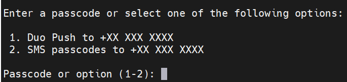

User Info
====

Server Access 
----
Here are the addess to the server. If you enter 5 times incorrect password within 30 mins, your IP will be blocked for 10 mins.

Server IP:

::

  ssh <user name>@<server IP/address>

**Login Authentication:**

The first time you log in to the server, you will be prompted to change your password. After changing your password, you will see a link similar to the one below. You need to copy and paste this into your web browser:

::

  https://<api>.duosecurity.com/frame/portal/v4/enroll?code=<key>

Please follow the instructions on the web to complete the authentication. Have your smartphone ready for this step. 

After you have registered, log in to the server again. You will be asked for authentication with your app. You can simply type `1` and push the green button prompt on the mobile app.

User Storage
----
The server was equipped with a total storage of 7 TB (3TB NVMe SSD + 4T SATA SSD), 5.3TB was avaiable to share bewteen all users. The user accounts are located under the ``/home`` path configured. The overview and the mount path as below:

::
  
  Filesystem             Size  Used Avail Use% Mounted on
  /dev/mapper/rhel-home  5.4T   52G  5.3T   1% /home

.. warning::
To optimize usage and performance, we did not apply Quota_ and RAID_ configurations on the server. Therefore, we recommend storing your test/experimental dataset on the server. However, please direct outputs from large databases and heavy processing to the NAS_, which is equipped with RAID_ and offers substantial storage capacity (36TB in total).

User Permission
----

**NAS access:**

The current configuration disabled the direct access from users to the NAS path. NAS access can be acquired from the administrator. You will find a soft link folder under your own ``/home/<user name>`` path.

**Python:**

Server-side Python is available through ``pyenv``, supporting versions 3.6-3.11. Package installation via pip is permitted only in a virtual environment, which you can manage using ``virtualenv``. For example:

.. code-block:: console

  pyenv virtualenv 3.7 <custom name of environment>
  pyenv activate <custom name of environment>

.. warning::

Do not install ``conda`` on the server. If you have complex dependencies please use Docker or setup it in your own virtual environment.

**Neuroimaging software:**

Popular neuroimaging software such as FSL, freesurfer, etc are loaded in Docker via image of Neurodesk.

**Matlab:**

Matlab setup was elaborated in the internal manual.

Data Backup
----

Currently, the NAS_ does not enable the auto sychronization for the server. This is planed.

.. _NAS: https://www.synology.com/en-uk/company/news/article/DS920plus
.. _Anaconda: https://www.anaconda.com/
.. _RAID: https://de.wikipedia.org/wiki/RAID
.. Quota: https://linux.die.net/man/1/quota
.. Neurodesk: https://www.neurodesk.org/docs/getting-started/neurodesktop/linux/
